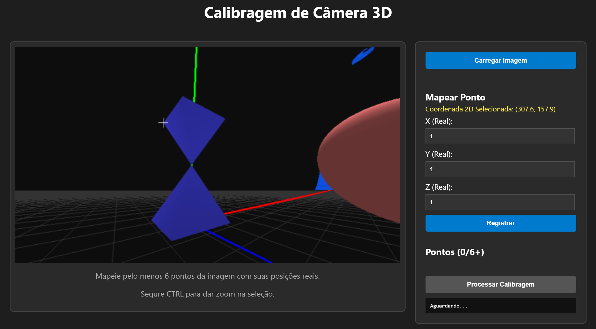

# Calibração de Câmera 3D via DLT (Direct Linear Transformation)

Esse projeto é uma ferramenta web interativa para extrair parâmetros (intrínsecos e extrínsecos) de uma câmera (real ou simulação) a partir de uma única imagem 2D, correlacionando pixels com coordenadas 3D do mundo real através do algoritmo de Transformação Linear Direta.

## Objetivo
Este projeto foi desenvolvido para calcular com precisão a posição, orientação e parâmetros da lente de uma câmera no momento em que uma imagem foi capturada. Através de uma interface web, o usuário pode mapear pontos da imagem e o algoritmo deduzirá a geometria correspondente.

## Uso

Para usar o projeto, você precisa de:
- Uma imagem tirada de uma câmera ou em um ambiente virtual que simula uma câmera (veja o repositório [Camera3D](https://github.com/Vitinholiv/Camera3D) para ter um exemplo de simulador).
- Ao menos 6 pontos em que conseguimos ver eles diretamente na imagem e também saber as coordenadas deles no mundo real.
- Execute o projeto, abrindo o arquivo `index.html` no seu navegador (ou acesse [este link](https://vitinholiv.github.io/CameraCalibration/)) e inserindo as informações citadas acima, clicando em seguida em processar calibragem.
- A página te retornará a matriz de projeção da sua câmera e os parâmetros relevantes dela.